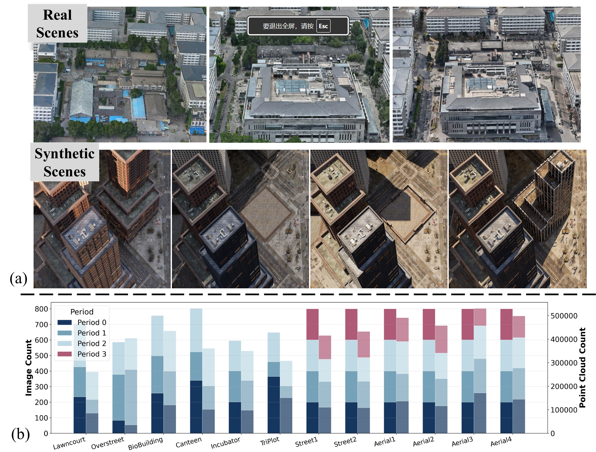

# ChronoScene Dataset

We introduce the **ChronoScene** dataset, a benchmark specifically designed for multi-period scene reconstruction. This dataset contains 12 multi-period scenes, including both real-world and synthetic scenes, capturing both geometric and appearance variations across different time periods. For each scene, we align all images of all periods into a common world coordinate frame in COLMAP format, ensuring that cameras across periods are spatially comparable.

<p align="center">
  
</p>

## Dataset Overview

The ChronoScene dataset provides a comprehensive benchmark for evaluating multi-period scene reconstruction methods, challenging existing approaches that assume static geometry or smooth temporal continuity.


## Dataset Characteristics

The ChronoScene dataset captures diverse real-world scenarios with temporal variations:

- **Geometric Changes**: Building construction, structure modifications, object additions/removals
- **Appearance Changes**: Seasonal variations, lighting conditions, material changes
- **Multi-Period Captures**: Each scene contains images captured across multiple time periods
- **Diverse Scenes**: Includes both indoor and outdoor scenes, aerial and ground-level views, urban and natural environments

## Scene Descriptions

The ChronoScene dataset includes both real-world and synthetic scenes, capturing both geometric and appearance variations across different time periods.

### Real-world Scenes

The real-world scenes in ChronoScene were captured at **Peking University** across multiple time periods (2016, 2023, and 2024), covering various campus regions that have undergone significant changes. We segmented several regions with notable temporal variations to create distinct scenes. For each scene, all images from different periods were aligned to a common world coordinate frame using GPS and manual calibration.

### Synthetic Scenes

The synthetic scenes in ChronoScene are inspired by the [MatrixCity](https://github.com/city-super/MatrixCity) dataset. We simulate real-world temporal variations in geometry and appearance by editing urban assets, and render images using Unreal Engine 5. This approach allows us to create controlled multi-period scenarios with precise ground truth for both geometric and appearance changes. 

## Dataset Structure

Each scene in the ChronoScene dataset follows the following structure:

```
scene_name/
├── images/              # Image folder
│   ├── 0000.png        # Image files (filename can be arbitrary)
│   ├── 0001.png
│   ├── 0002.jpg
│   └── ...
└── sparse/
    ├── split.txt        # Timestamp mapping file (required)
    └── 0/               # COLMAP reconstruction results
        ├── cameras.bin
        ├── images.bin
        ├── points3D.bin
        └── test.txt     # Test set image list (optional)
```

### Directory Structure

- **`images/`**: Contains multi-period images captured at different time periods
- **`sparse/0/`**: Contains COLMAP reconstruction files and test set split
- **`sparse/split.txt`**: Defines the mapping between image names and their period (timestamp) IDs

### split.txt Format

The `split.txt` file is **required** and should be placed in the `sparse/` directory. This file defines the mapping between image names and their corresponding period (timestamp) IDs. Each line contains an image name (with file extension) and its timestamp ID (0~T-1), separated by a space. ChronoGS will automatically calculate the number of periods T from the unique timestamp IDs in this file.

**Important**: The image name in `split.txt` should match the actual image filename **with the file extension**. For example:
- If your image file is `0000.png`, use `0000.png` in `split.txt`
- If your image file is `image_001.jpg`, use `image_001.jpg` in `split.txt`

Example `split.txt`:
```
0000.png 0
0001.png 0
0002.png 1
0003.png 1
IMG_1234.png 0
IMG_1235.png 2
...
```

**Note**: The filename itself does not need to contain any period information. The period assignment is **solely determined by the mapping in `split.txt`**.

## Dataset Statistics

- **Total Scenes**: 12 multi-period scenes
- **Image Format**: PNG or JPG
- **Timestamp IDs**: 0~T-1, where T is the number of periods, provided in `split.txt`
- **COLMAP Format**: Standard COLMAP binary files (cameras.bin, images.bin, points3D.bin)
- **Test Split**: Provided in `sparse/0/test.txt` for each scene


## Usage

To use the ChronoScene dataset with ChronoGS, please refer to the [Data Preparation](../README.md#data-preparation) section in the main README.

## Citation

If you use the ChronoScene dataset in your research, please cite our paper:

```bibtex
@misc{wang2025chronogs,
      title={ChronoGS: Disentangling Invariants and Changes in Multi-Period Scenes}, 
      author={Zhongtao Wang and Jiaqi Dai and Qingtian Zhu and Yilong Li and Mai Su and Fei Zhu and Meng Gai and Shaorong Wang and Chengwei Pan and Yisong Chen and Guoping Wang},
      year={2025},
      eprint={2511.18794},
      archivePrefix={arXiv},
      primaryClass={cs.GR},
      url={https://arxiv.org/abs/2511.18794}, 
}
```

## License

The ChronoScene dataset is released under the [Apache License 2.0](DATASET_LICENSE.md).

**Key Points**:
- ✅ Free for research, educational, and commercial use
- ✅ Allows modification and distribution
- ✅ Requires citation of the original paper (see Citation section)
- ✅ Requires inclusion of copyright notice and license file when redistributing

Please refer to [DATASET_LICENSE.md](DATASET_LICENSE.md) for the complete license terms and conditions.

## Download

The ChronoScene dataset is available through the following download links:

### Download Options


- **Peking University Cloud Storage**
   - Link: [https://disk.pku.edu.cn/link/AA13F383F5CD6B462D8C7B745D4576133D](https://disk.pku.edu.cn/link/AA13F383F5CD6B462D8C7B745D4576133D)
   - Filename: `ChronoScene.zip`

- **Baidu Netdisk**
   - Link: [https://pan.baidu.com/s/1PLDmMzUFP_5QIStMMiz7xw](https://pan.baidu.com/s/1PLDmMzUFP_5QIStMMiz7xw)
   - Extraction code: `sfpj`
   - Filename: `ChronoScene.zip`

- **Hugging Face**
   - Link: [https://huggingface.co/datasets/wangzhongtao/ChronoScene](https://huggingface.co/datasets/wangzhongtao/ChronoScene)
   - Direct access through Hugging Face Datasets

### Usage Instructions

After downloading and extracting the dataset, please refer to the [Data Preparation](../README.md#data-preparation) section in the main README for usage instructions.

For questions or issues, please contact the authors or open an issue on [GitHub](https://github.com/ZhongtaoWang/ChronoGS/issues).

