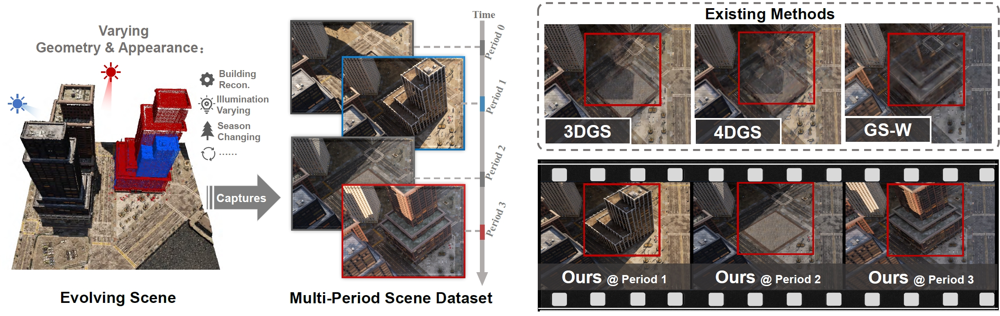
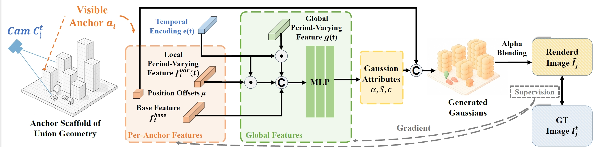

# ChronoGS: Disentangling Invariants and Changes in Multi-Period Scenes

[](https://arxiv.org/abs/2511.18794)
[](https://github.com/ZhongtaoWang/ChronoGS)
[](https://github.com/ZhongtaoWang/ChronoScene/DATASET.md)

<p align="center">
  
</p>

**ChronoGS** is a multi-period scene reconstruction framework based on 3D Gaussian Splatting, capable of reconstructing and disentangling geometric and appearance changes across different periods within a unified representation.

## 📖 Introduction

Multi-period image collections are common in real-world applications. Cities are re-scanned for mapping, construction sites are revisited for progress tracking, and natural regions are monitored for environmental change. Such data form multi-period scenes, where geometry and appearance evolve over time. Reconstructing such scenes is an important yet underexplored problem.

Existing pipelines rely on incompatible assumptions: static and in-the-wild methods enforce a single geometry, while dynamic ones assume smooth motion, both failing under long-term, discontinuous changes. To solve this problem, we introduce **ChronoGS**, a temporally modulated Gaussian representation that reconstructs all periods within a unified anchor scaffold. It's also designed to disentangle stable and evolving components, achieving temporally consistent reconstruction of multi-period scenes.

## 🎯 Overview

<p align="center">
  
</p>

## ✨ Key Features

- **Unified Anchor Scaffold**: Reconstructs all periods within a unified geometric scaffold across periods
- **Temporally Decoupled Representation**: Separates invariant base features and period-specific varying features
- **Geometry Activation Mechanism**: Enables the scaffold to express period-specific geometry while maintaining global spatial consistency
- **Multi-Period Consistency**: Achieves consistent and faithful reconstruction across periods
- **Supports Geometry and Appearance Changes**: Handles both geometric and appearance evolution simultaneously


## 📊 Dataset

We introduce the **ChronoScene** dataset, a benchmark specifically designed for multi-period scene reconstruction. This dataset contains 12 multi-period scenes, including both real-world and synthetic scenes, capturing both geometric and appearance variations across different time periods.

For detailed information about the dataset, including structure, statistics, and usage instructions, please refer to [DATASET.md](DATASET.md).

## 🚀 Quick Start

### Requirements

- Python
- CUDA 
- PyTorch 
- CUDA-capable GPU

### Installation

1. Clone the repository:
```bash
git clone https://github.com/ZhongtaoWang/ChronoGS.git
cd ChronoGS
```

2. Create a conda environment and install dependencies:
```bash
conda create -n chronogs python=3.8.19
conda activate chronogs
pip install -r requirements.txt # please modify the CUDA version according to your own environment in requirements.txt
```

3. Install torch-scatter and gsplat:
```bash
pip install torch-scatter
pip install gsplat
```

### Data Preparation

ChronoGS supports COLMAP format data. The data directory structure should be as follows:

```
scene_name/
├── images/              # Image folder
│   ├── 0000.png        # Image files (filename can be arbitrary)
│   ├── 0001.png
│   ├── 0002.jpg
│   └── ...
└── sparse/
    ├── split.txt        # Timestamp mapping file (required)
    └── 0/               # COLMAP reconstruction results
        ├── cameras.bin
        ├── images.bin
        ├── points3D.bin
        └── test.txt     # Test set image list (optional)
```

**split.txt file format**: The `split.txt` file is **required** and should be placed in the `sparse/` directory. This file defines the mapping between image names and their corresponding period (timestamp) IDs. Each line contains an image name (without file extension) and its timestamp ID (0~T-1), separated by a space. ChronoGS will automatically calculate the number of periods T from the unique timestamp IDs in this file.

**Important**: The image name in `split.txt` should match the actual image filename **without the file extension**. For example:
- If your image file is `0000.png`, use `0000` in `split.txt`
- If your image file is `image_001.jpg`, use `image_001` in `split.txt`

Example `split.txt`:
```
0000.png 0
0001.png  0
0002.png  1
0003.png  1
IMG_1234.png  0
IMG_1235.png  2
...
```

**Note**: The filename itself does not need to contain any period information. The period assignment is **solely determined by the mapping in `split.txt`**.

### Training

Train with a configuration file:

```bash
python train.py --config config/chronogs.yaml \
    --source_path /path/to/your/data \
    --model_path /path/to/output/model \
    --eval # add this flag to use training/test split for evaluation
```

### Rendering

Render a trained model:

```bash
python render.py \
    -m /path/to/output/model \
    -s /path/to/your/data \
    --eval # add this flag to use training/test split for evaluation
```

### Evaluation

Compute metrics (PSNR, SSIM, LPIPS) for rendered results:

```bash
python metrics.py -m /path/to/output/model
```

Or evaluate multiple models:

```bash
python metrics.py -m /path/to/model1 /path/to/model2
```

Evaluation results will be saved in `model_path/results.json` and `model_path/per_view.json`.


### Temporal interpolation

Temporal interpolation is supported in ChronoGS. You can interpolate the scene at any time period by providing the time period timestamp. For example, to interpolate the scene at the middle of the 1st and 2nd time period, you can manually set viewpoint.time_stamp to 0.5.


## ⚙️ Configuration

Main configuration parameters are in `config/chronogs.yaml`:

- **Model Parameters**:
  - `varing_feat_dim`: Varying feature dimension (default: 16)
  - `base_feat_dim`: Base feature dimension (default: 16)
  - `global_feat_dim`: Global feature dimension (default: 32)
  - `n_offsets`: Number of offsets (default: 10)

For detailed configuration, please refer to the `config/chronogs.yaml` file.


## 📝 Citation

If you use ChronoGS in your research, please cite our paper:

```bibtex
@misc{wang2025chronogs,
      title={ChronoGS: Disentangling Invariants and Changes in Multi-Period Scenes}, 
      author={Zhongtao Wang and Jiaqi Dai and Qingtian Zhu and Yilong Li and Mai Su and Fei Zhu and Meng Gai and Shaorong Wang and Chengwei Pan and Yisong Chen and Guoping Wang},
      year={2025},
      eprint={2511.18794},
      archivePrefix={arXiv},
      primaryClass={cs.GR},
      url={https://arxiv.org/abs/2511.18794}, 
}
```

## 📄 License

This project is licensed under the same license as [3D Gaussian Splatting](https://github.com/graphdeco-inria/gaussian-splatting). The software is free for non-commercial, research and evaluation use. 


For more details, please refer to:
- [3D Gaussian Splatting License](https://github.com/graphdeco-inria/gaussian-splatting/blob/main/LICENSE.md)

## 📧 Contact

For questions or suggestions, please contact us via:

- Github Issue: [https://github.com/ZhongtaoWang/ChronoGS/issues](https://github.com/ZhongtaoWang/ChronoGS/issues)

## 🔗 Related Links

We would like to acknowledge the following repositories that have inspired and contributed to the development of this project:

- [3D Gaussian Splatting](https://github.com/graphdeco-inria/gaussian-splatting) - The original 3D Gaussian Splatting implementation
- [Scaffold-GS](https://github.com/city-super/Scaffold-GS) - Structured 3D Gaussians for view-adaptive rendering
- [Octree-GS](https://github.com/city-super/Octree-AnyGS) - LOD-structured 3D Gaussians for consistent real-time rendering
- [gsplat](https://github.com/nerfstudio-project/gsplat) - Efficient 3D Gaussian Splatting backend
- [MatrixCity](https://github.com/city-super/MatrixCity) - A large-scale synthetic dataset for city-scale neural rendering
